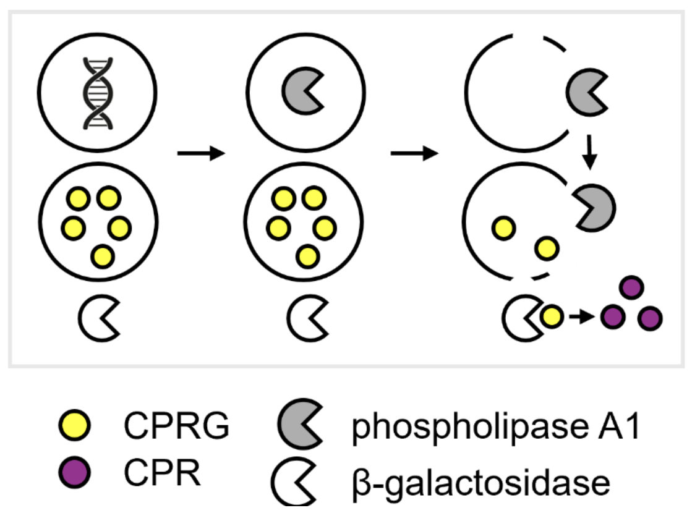
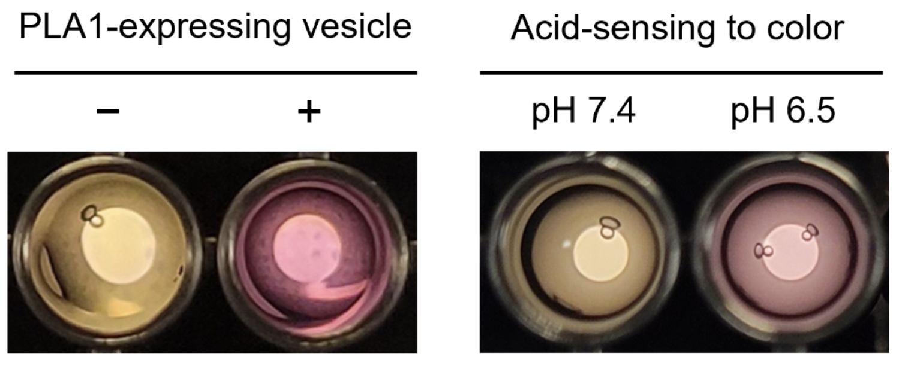

<!--
Editing convention: a section marked `@claude please don't rewrite this section`,
or commented out, is protected. Claude will not regenerate, reflow or reword it.
-->

# Overview

The pH-sensing developer cells detect acidic conditions (pH 6.0–6.5) using a pH-responsive ssDNA system. Acidification releases a trigger ssDNA, which activates a toehold switch RNA and induces expression of the protein of interest. To generate a visible colorimetric output, a two-vesicle population system is used. Upon sensing acidic pH, the sensor cells express phospholipase A1 (PLA1), which disrupts neighboring CPRG-loaded vesicles and releases CPRG into the surrounding solution. External β-galactosidase then converts the yellow CPRG substrate into purple CPR, producing a visible color change.

:::{figure}
:label: fig-overview
:align: center
:width: 100%

**Schematic and visual demonstration of the pH-responsive two-vesicle colorimetric system.** **(A)** Schematic of the two-vesicle reporter system. **(B)** Colorimetric response in the absence and presence of PLA1-expressing vesicles. **(C)** Visible color change generated by pH-sensing developer cells under acidic conditions.
:::

# Reagents

::::{admonition} Reagents and equipment table
:class: dropdown

:::{table} Reagents and equipment. Vendor data for the energy solution components comes from the composition sheet; the remaining entries were matched against `DevCell_Materials_Tracker.xlsx`, which carries no manufacturer, price or storage columns.
:label: tbl-reagents
:align: center

| Reagent | Product Name | Manufacturer | Catalog No. | Price | Storage Conditions | Link |
| --- | --- | --- | --- | --- | --- | --- |
| Spermidine | — | Millipore Sigma | S2626 | — | — | |
| Creatine phosphate | — | Millipore Sigma | 10621714001 | — | — | |
| Magnesium acetate tetrahydrate | — | Millipore Sigma | M5661 | — | — | |
| L-Glutamic acid potassium salt monohydrate | Potassium glutamate | Millipore Sigma | G1501 | — | — | |
| Folinic acid calcium salt hydrate | — | Millipore Sigma | F7878 | — | — | |
| ATP | — | Millipore Sigma | A6419-1G or 5G | — | — | |
| GTP | — | Millipore Sigma | G8877-250MG | — | — | |
| CTP | — | Millipore Sigma | C1506-250MG | — | — | |
| UTP | — | Millipore Sigma | U6750-1G or 500MG | — | — | |
| Amino acid mix (RTS Amino Acid Sampler) | — | Biotechrabbit | BR1401801 | — | — | |
| RNase Inhibitor | RNAse inhibitor murine | NEB | M0314S | $87.00 | -25 °C to -15 °C | [link](https://www.neb.com/en-us/products/m0314-rnase-inhibitor-murine) |
| Mineral oil | Mineral oil, BioReagent, for molecular biology, light oil | Millipore Sigma | M5904-500mL | $78.70 | RT | [link](https://www.sigmaaldrich.com/US/en/product/sigma/m5904) |
| Cy5 | Sulfo-Cyanine5 carboxylic acid | Lumiprobe | 13390 | $99.00 | -20 °C | [link](https://www.lumiprobe.com/p/sulfo-cy5-carboxylic-acid) |
| CPRG | Chlorophenol Red-β-D-galactopyranoside | Roche | 10884308001 | $160.00 | -20 °C in water at 20 mg/mL | [link](https://www.sigmaaldrich.com/US/en/product/roche/10884308001) |
| POPC | 16:0-18:1 PC (POPC) | Avanti Lipids | A80557 | $435.00 | -20 °C | [link](https://www.avantiresearch.com/en-gb/products/product/850457-160-181-pc-popc) |
| Rhod PE | Liss Rhod PE | Avanti Lipids | A81179 | $273.47 | -20 °C | [link](https://www.avantiresearch.com/en-gb/products/product/810179-180-liss-rhod-pe) |
| Cholesterol | Cholesterol | Avanti Research | A80100 | $261.00 | -20 °C | [link](https://www.avantiresearch.com/en-gb/products/product/700100-cholesterol-plant) |
| IDT duplex buffer | Nuclease Free Duplex Buffer (10 x 2 mL) | IDT | 11-01-03-01 | $17.00 | -20 °C | [link](https://www.idtdna.com/site/order/stock/index/nfd) |
| UPDI (water) | UltraPure™ DNase/RNase-Free Distilled Water | Invitrogen | 10977015 | $61.25 | RT | [link](https://www.thermofisher.com/order/catalog/product/10977015) |
| Optiprep | OptiPrep™ | STEMCELL Technologies | 07820 | $289.00 | RT | [link](https://www.stemcell.com/products/optipreptm.html) |
| Liposome extruder | Mini Extruder Pro Kit with base | Avanti Lipids | A81411 | — | RT | [link](https://www.avantiresearch.com/en-gb/products/product/1000061-mini-extruder-pro-kit-with-base) |
| Membrane filter | PC Membranes 0.4 µm, 19 mm | Avanti Lipids | A89040 (legacy 610007) | — | RT | [link](https://www.avantiresearch.com/en-gb/products/product/610007-pc-membranes-04m) |
| SMix | — | b.next | — | — | — | |
| PMix | — | b.next | — | — | — | |
| Ribosomes | — | b.next | — | — | — | |
| tRNA | — | b.next | — | — | — | |
| Tris base | — | — | — | — | — | |
| HEPES | HEPES, Crystalline Powder, ≥99.5% (titration), Poly bottle | Sigma-Aldrich | H3375-500G | $431.00 | 4 °C to 30 °C | [link](https://www.sigmaaldrich.com/US/en/product/sigma/h3375) |
| HCl | Hydrochloric acid, ACS reagent, 37% | Millipore Sigma | 320331-500ML | $106.00 | 4 °C to 30 °C | [link](https://www.sigmaaldrich.com/US/en/product/sigald/320331) |
| Low-gelling agarose | Agarose, low gelling temperature, BioReagent, for molecular biology | Sigma-Aldrich | A9414-5G | — | RT | [link](https://www.sigmaaldrich.com/US/en/product/sigma/a9414) |
:::
::::

Two entries were ambiguous in `DevCell_Materials_Tracker.xlsx`, which stocks two mineral oils and two Cy5 materials and does not say which were used. Both are now resolved by the author.

The mineral oil is `M5904`. `M5310` was never used, although the tracker notes it is the higher quality one.

The energy solution's magnesium salt is also worth a note: it calls for magnesium acetate tetrahydrate, Millipore Sigma `M5661`, and `DevCell_Materials_Tracker.xlsx` stocks magnesium glutamate at both nodes and no magnesium acetate at either one.

Cy5 means `Sulfo-Cyanine5 carboxylic acid` throughout, used as a soluble dye encapsulated inside the GUVs. The lipid-conjugated `18:1 Cyanine 5 PC` was not used in this system. Rhod-PE is the only lipid fluorescence label.

Nine more entries are filled from sources outside `DevCell_Materials_Tracker.xlsx`: Mineral oil, Cy5, CPRG, the IDT duplex buffer and UPDI water from the "Chicago Module Integration Status" Doc's pH Sensor materials table and, for UPDI water, this DevNote's own LGA Gel Preparation materials list; the liposome extruder, its membrane filter and the low-gelling agarose from Avanti's and Sigma's own catalogs, cross-checked against `DevCell_Materials_Tracker.xlsx`'s "Mini Extruder Pro Kit" and "PC Membranes 0.4μm" entries and against this DevNote's own LGA materials list. SMix, PMix, Ribosomes and tRNA are marked `b.next` rather than left blank — these are made in-house, not purchased, the same way the Chicago Doc records its own Cytosol row.

HEPES is filled from the Nucleus materials reference, `HEPES, Crystalline Powder`, Sigma-Aldrich `H3375-500G`, not confirmed against this experiment's own outer solution recipe. HCl is the 37% (concentrated) product the recipe actually calls for, Millipore Sigma `320331-500ML`, not the Nucleus reference's 1 N entry, which is a different product at a different concentration. The "Chicago Module Integration Status" Doc raises the outer solution's Tris base and HEPES sourcing as an open question for this same experiment and supplies no catalog number for either.

Tris base stays blank. No Tris base entry of any kind exists in the Nucleus materials reference, searched directly and by every related term (Trizma, Tris-HCl); the reference's only Tris-named row is an unrelated electrophoresis gel product.

# Constructs

:::{table} DNA constructs. Sequences are reproduced in full; both oligo lengths were verified against their GenBank `LOCUS` line.
:label: tbl-constructs
:align: center

| Name | Sequence | Purpose |
| --- | --- | --- |
| [pT7-toehold9-PLA1](./dna/Linear-T7-toehold9-PLA1-t7hyb6-extra-BbsI-site.gbk) | Sequence map below | DNA template for PLA1 expression in the GUV inner solution. 80 nM stock, 2 nM final. Linear construct, 1203 bp. |
| [pH-responsive_ssDNA#2](./dna/ph-responsive-ssdna2.gb) | TTCTCTTCTCGTTTGCTCTTCTCTTGTGTGGTATTGTCCAAGAGAAGAG | pH-responsive strand of the gate, 49 bp. |
| [Trigger_ssDNA#3](./dna/trigger-ssdna3.gb) | TATGCAAACAAGACAATACCACACAATTTTTTTTTT | Trigger strand, 36 bp. |
:::

The last two anneal 3:1 in IDT duplex buffer to form the construct listed as `pH-responsive:Trigger ssDNA (3:1) annealed construct` in {numref}`tbl-pla1-guv-is`, where the 25 µM stock concentration is that of the trigger strand. Both files verified: `pH-responsive_ssDNA#2` declares 49 bp and carries 49 bases, `Trigger_ssDNA#3` declares 36 bp and carries 36 bases.

Annealing was performed in a thermocycler using the following protocol: 5 min at 95 °C, followed by stepwise cooling at 2 min per degree to the melting temperature of the construct (Tm = 52 °C), 30 min per degree from 52 °C to Tm − 10 °C (42 °C), and finally 2 min per degree until reaching 25 °C. The annealed construct was stored at −20 °C.

`DevCell_Materials_Tracker.xlsx` records the function test for `T7-toehol9-PLA1` as "Done/Leaky". The pH 7.6 arm is the condition leakiness would contaminate, since it is meant to show no PLA1 activity.

`pT7-toehold9-PLA1` is 1203 bp, too long to read as inline text, so it is shown as a sequence map. The two gate oligos stay inline above, because each is under 50 bases.

:::{seqviz} https://github.com/nucleus-eng/DNA/blob/devcells/devstudio-constructs/effectors/detector-ph/pT7-toehold9-PLA1-linear.gb
:height: 600px
:::

Sequence map of `pT7-toehold9-PLA1`. The file declares 1203 bp and carries 1203 bases, and its sequence matches `pT7-toehold9-PLA1-linear.gb` on `nucleus-eng/DNA` branch `devcells/devstudio-constructs`.

# Protocol

Section order follows the source log, which prepares the CPRG-LUVs first. The
composition tables under Methods run in the other order.

How the three preparations below fit together. Structure follows
`render/20261005-demo-ph.mmd` in `nucleus-eng/devstudio-readiness`. The
readiness overlay's status colors are left out, because that diagram tracks
program progress and this page is a record of one set of runs.

Shaded nodes are described in this DevNote, with a section, a table or a
table row giving their composition. Unshaded nodes are named in the build
but carry no description here: `(M13) Basic buffer` and its LacZ enzyme
appear only in prose, with no reagent entry, no concentration and no buffer
recipe, and `(M14) CPRG released gel` and `P6` have no write-up at all.
Click P3, P4 or P5 to jump to its protocol.

```mermaid
flowchart TD
    PH_RES["(M1) pH-responsive strand"]
    TRIGGER["(M2) Trigger"]
    CYTOSOL["(M3) Cytosol"]
    PH_DNA["(M4) pH-sensing DNA"]
    TOEHOLD["(M5) Toehold switch [PLA]"]
    CPRG["(M6) Substrate: CPRG"]
    MEMBRANE_V["(M7) Membrane"]
    PH_CYTOSOL["(M8) pH Sensor Cytosol"]
    MEMBRANE_C["(M9) Chicago Base Membrane: POPC/Chol<br/>Membrane[POPC &#8862; Chol &#8862; Rhod], 9:1, 0.1% Rhod"]
    CPRG_VESICLE["(M10) CPRG Vesicle"]
    PH_CELL["(M11) pH Sensing Cell"]
    HYDROGEL["(M12) Hydrogel: LGA"]
    BASIC_BUFFER["(M13) Basic buffer &#8862; LacZ Enzyme"]
    RELEASED_GEL["(M14) CPRG released gel"]
    COLOR["Color"]

    P1(["P1 &middot; Anneal pH-Responsive Trigger Duplex<br/>3:1"])
    P2(["P2 &middot; Assemble Aqueous Solution"])
    P3(["P3 &middot; Encapsulation: SUV extrusion"])
    P4(["P4 &middot; Encapsulation: Phase Transfer"])
    P5(["P5 &middot; Gel embed &amp; incubation, 37 &deg;C"])
    P6(["P6 &middot; Color Development<br/>incubation"])

    PH_RES --> P1
    TRIGGER --> P1
    P1 --> PH_DNA

    CYTOSOL --> P2
    PH_DNA --> P2
    TOEHOLD --> P2
    P2 --> PH_CYTOSOL

    CPRG --> P3
    MEMBRANE_V --> P3
    P3 --> CPRG_VESICLE

    PH_CYTOSOL --> P4
    MEMBRANE_C --> P4
    P4 --> PH_CELL

    CPRG_VESICLE --> P5
    PH_CELL --> P5
    HYDROGEL --> P5
    P5 --> RELEASED_GEL

    BASIC_BUFFER --> P6
    RELEASED_GEL --> P6
    P6 --> COLOR

    click P3 "#cprg-luv-preparation"
    click P4 "#pla1-guv-preparation"
    click P5 "#lga-gel-preparation"

    %% Shaded = described in this DevNote. Unshaded = named in the build, not described here.
    classDef described fill:#DCE9F5,stroke:#3A6E9E,stroke-width:1.5px,color:#111827;
    class PH_RES,TRIGGER,CYTOSOL,PH_DNA,TOEHOLD,CPRG,MEMBRANE_V,PH_CYTOSOL,MEMBRANE_C,CPRG_VESICLE,PH_CELL,HYDROGEL,COLOR,P1,P2,P3,P4,P5 described;
```

:::{admonition}
Two protocol questions are open.

In CPRG-SUV preparation step 7, 15 µL from each of six tubes is 90 µL, not the 75 µL stated. Step 8 then adds 175 µL to reach 250 µL, which agrees with 75, so the tube count looks like the slip and five tubes would give 75. The LUV protocol says six tubes for 90 µL and adds 160 µL, which is self-consistent. Which is right for the SUV route?

Attempt 4 is the one that worked, and the three changes that made it work carry no numbers: the starting volume was increased, more rounds of washing were done, and the gel went from 0.7% to 0.35%. Only the gel concentration is quantified. What was the new starting volume, and how many washes?
:::

## CPRG-LUV preparation

1. Add the inner solution directly to the dried lipid film.
2. Vortex until the film is no longer visible.
3. Sonicate the suspension for 10 min.
4. Run 5 freeze-thaw cycles. One cycle is three operations:
    - Freeze in liquid nitrogen.
    - Thaw in a 35 °C water bath.
    - Vortex for 30 s.
5. Combine each of 12 tubes holding 50 µL LUVs with 200 µL outer solution.
6. Centrifuge at 10,000 g for 10–20 min to pellet the vesicles.
7. Pool the pellets into two tubes. Take 15 µL from each of six tubes, 90 µL in total.
8. Add 160 µL outer solution to each tube, for a final volume of 250 µL.
9. Wash 10 times. One wash is three operations:
    - Centrifuge at 4,000 g for 10 min.
    - Remove 200 µL supernatant without disturbing the pellet.
    - Add 200 µL fresh outer solution.

    Alternate the tube orientation with each wash, so the pellet moves to the
    opposite side. This releases unencapsulated or trapped solution held
    between vesicles.
10. After the final wash, leave the tubes on ice for at least 30 min.
11. Tap the tubes gently to resuspend the pellet. Do not pipette.

## CPRG-SUV preparation

Used from Attempt 3 onward. The LUV route above was used for Attempts 1 and 2.

1. Add the inner solution (1 mL) directly to the dried lipid film.
2. Vortex until the film is no longer visible.
3. Sonicate the suspension for 10 min.
4. Run 5 freeze-thaw cycles. One cycle is three operations:
    - Freeze in liquid nitrogen.
    - Thaw in a 35 °C water bath.
    - Vortex for 30 s.
5. Assemble a liposome extruder (Avanti `A81411`) with a 400 nm pore size membrane filter, and pass the lipid suspension through it 13 times to make SUVs.
6. Centrifuge at 15,000 g for 10–20 min to pellet the vesicles.
7. Pool the pellets into two tubes. Take 15 µL from each of six tubes, 75 µL in total. <!-- REVIEW: 15 µL from six tubes is 90 µL, not 75. Step 8 adds 175 µL to reach 250 µL, which is consistent with 75, so the tube count is the likely error and five tubes would give 75. Carried as written. -->
8. Add 175 µL outer solution to each tube, for a final volume of 250 µL.
9. Wash 10 times. One wash is three operations:
    - Centrifuge at 10,000 g for 10 min.
    - Remove 200 µL supernatant without disturbing the pellet.
    - Add 200 µL fresh outer solution.

    Alternate the tube orientation with each wash, so the pellet moves to the
    opposite side. This releases an unencapsulated or trapped solution held
    between vesicles.
10. After the final wash, leave the tubes on ice for at least 30 min.
11. Tap the tubes gently to resuspend the pellet. Do not pipette.

(pla1-guv-preparation)=
## PLA1-GUV preparation

The inverted emulsion method. Lipid volumes in step 1 are the 3 mL working
scale, which is 1.5 µmol of total lipid. {numref}`tbl-pla1-guv-mb` states the
same membrane at the 5 mL scale, which is 2.5 µmol. The mol% is identical.

1. Combine three lipid stocks in a 20 mL glass vial. All three stocks are in chloroform.
    - 41.0 µL of 25 mg/mL POPC.
    - 1.16 µL of 50 mg/mL cholesterol.
    - 1.95 µL of 1 mg/mL rhodamine-PE.

    This gives 89.9 / 10 / 0.1 mol% POPC, cholesterol and Rhod-PE.
2. Remove the chloroform under a gentle argon flow.
3. Dry the vial in a vacuum desiccator for 30 min.
4. Rehydrate the lipids in 3 mL mineral oil, to 0.5 mM total lipid in oil.
5. Seal the vial. Disperse the lipids in four operations:
    - Bath sonicate for 20 min.
    - Incubate at 60 °C for 1 h.
    - Vortex for 2 min.
    - Bath sonicate again for 20 min.
6. Gently layer 300 µL of the lipid-in-oil dispersion over 400 µL of vesicle outer solution in a 1.5 mL tube.
7. Incubate the tube at room temperature for 10–20 min.
8. Prepare the inner encapsulation solution in a separate 1.5 mL tube during that incubation.
9. Add 600 µL of the lipid-in-oil dispersion to the inner solution.
10. Pipette the mixture up and down thoroughly for 3 min, to produce water-in-oil monolayer emulsion droplets.
11. Add the droplets on top of the oil-water interface formed in step 6.
12. Centrifuge at 2,500 g for 15 min at 15 °C.
13. Remove the oil phase carefully with a pipette.
14. Collect the vesicles into a 0.2 mL PCR tube with a fresh pipette tip.
15. Resuspend the vesicles gently.

(lga-gel-preparation)=
## LGA Gel Preparation

Materials

1. UltraPure™ DNase/RNase-Free Distilled Water, Invitrogen™ Cat number 10977015
2. Low-gelling agarose, Sigma, A9414-5G

Procedure:

1. Make 2.7% agarose stock dissolved in UPDI water (UltraPure™ DNase/RNase-Free Distilled Water)

    For 1500 uL stock preparation, weigh 40.5 mg directly in 2 mL epitube and add 1500 uL of UPDI water). Heat in 85-95 C heat block until fully dissolved. Vortex occasionally.

2. Synthetic cell (vesicle) embedment in 0.7% agarose

    Compositions:

    | Component | Fraction | Volume | Notes |
    | --- | --- | --- | --- |
    | energy solution (2x) | 50 v/v% | 30 uL | |
    | pH buffer mix* | 12 v/v% | 7.2 uL | |
    | 2.7% agarose dissolved in UPDI | 26 v/v% | 15.6 uL | |
    | GUVs, SUVs or substrates | 12 v/v% | 7.2 uL | in 46.67% of Tris1M-HEPES1.15M solution; osmolarity 1170-1180 mOsm |
    | Total | 100 v/v% | 60 uL | |

    1. First, cool the 2.7% agarose stock to 65C.
    2. Mix the agarose with Energy solution and pH buffer mix* first, and cool to 45C.
    3. Add CFE-containing vesicles.

    For 0.35% final agarose concentration, half of gel volume can be replaced with UPDI water.

3. pH buffer mix* preparation

    pH buffer mix was prepared so that resulting pH to be 1) pH 7.4 or 2) pH 6.5 (also to match osmolarity)

    1. For pH7.4: use Tris1M-HEPES1.15M buffer stock (~2520 mOsm)

    2. For pH6.5:

        | Component | Fraction | Volume |
        | --- | --- | --- |
        | Tris1M-HEPES1.15M buffer stock | 38.89 v/v% | 466.67 uL |
        | 2M HEPES stock | 48.02 v/v% | 576.19 uL |
        | 37% HCl | 6.67 v/v% | 80 uL |
        | Ultra-pure distilled water | 6.43 v/v% | 77.14 uL |
        | Total | 100 v/v% | 1200 uL |

# Methods

## PLA1-expressing GUVs

:::::{tab-set}
::::{tab-item} Inner solution

:::{table} PLA1-GUV inner solution.
:label: tbl-pla1-guv-is
:align: center

| Component | Stock Conc. | Unit | Final Conc. | Unit | Volume (µL) | Notes |
| --- | --- | --- | --- | --- | --- | --- |
| SMix | 3.33 | × | 1 | × | 6 | |
| PMix | 15 | mg/mL | 1.80 | mg/mL | 2.4 | |
| Ribosomes | 10 | µM | 1.8 | µM | 3.6 | |
| tRNA | 35 | mg/mL | 3.5 | mg/mL | 2 | |
| pT7-toehold9-PLA1 DNA template | 80 | nM | 2 | nM | 0.5 | sequence file not verified |
| pH-responsive:Trigger ssDNA (3:1) annealed construct | 25 | µM | 4.625 | µM | 3.7 | stock conc. is of the trigger ssDNA; annealed in IDT duplex buffer |
| Optiprep | 100 | % | 4.5 | v/v% | 0.9 | |
| RNase Inhibitor | 40000 | U/mL | 1000 | U/mL | 0.5 | |
| Cy5 | 100 | µM | 2 | µM | 0.4 | |
| Total | — | — | — | — | 20 | |
:::
::::

::::{tab-item} Membrane

:::{table} PLA1-GUV membrane. Volumes are for the lipid-in-oil stock, not per well.
:label: tbl-pla1-guv-mb
:align: center

| Component | Stock Conc. | Unit | Final Conc. | Unit | Volume (µL) | Moles (µmol) | MW (g/mol) |
| --- | --- | --- | --- | --- | --- | --- | --- |
| POPC | 25 | mg/mL | 89.9 | mol% | 68.3308324 | 2.2475 | 760.076 |
| Cholesterol | 50 | mg/mL | 10 | mol% | 1.9333 | 0.25 | 386.66 |
| Rhod PE | 1 | mg/mL | 0.1 | mol% | 3.2542875 | 0.0025 | 1301.715 |
| Total | — | — | 100 | mol% | — | 2.5 | — |
:::

Source note, carried verbatim: "dried and taken up in 3 mL mineral oil to 0.5 mM lipid-in-oil". See [PLA1-GUV preparation](#pla1-guv-preparation) under Protocol: 3 mL is the protocol's own working scale, 1.5 µmol; this table states the same membrane at 5 mL, 2.5 µmol. Same mol%, not a contradiction.
::::
:::::

## CPRG-loaded LUVs

:::::{tab-set}
::::{tab-item} Inner solution

:::{table} CPRG-LUV inner solution.
:label: tbl-cprg-luv-is
:align: center

| Component | Stock Conc. | Unit | Final Conc. | Unit | Volume (µL) |
| --- | --- | --- | --- | --- | --- |
| CPRG | 30 | mg/mL | 14.25 | mg/mL | 237.5 |
| Optiprep | 100 | v/v% | 10 | v/v% | 50 |
| Tris1M-HEPES1.15M buffer (~2520 mOsm) | 2520 | mOsm | 1071 | mOsm | 212.5 |
| Total | — | — | — | — | 500 |
:::
::::

::::{tab-item} Membrane

:::{table} CPRG-LUV membrane. Volumes are for the lipid stock, not per well.
:label: tbl-cprg-luv-mb
:align: center

| Component | Stock Conc. | Unit | Final Conc. | Unit | Volume (µL) | Moles (µmol) | MW (g/mol) |
| --- | --- | --- | --- | --- | --- | --- | --- |
| POPC | 25 | mg/mL | 89.9 | mol% | 54.66466592 | 1.798 | 760.076 |
| Cholesterol | 50 | mg/mL | 10 | mol% | 1.54664 | 0.2 | 386.66 |
| Rhod-PE | 1 | mg/mL | 0.1 | mol% | 2.60343 | 0.002 | 1301.715 |
| Total | — | — | 100 | mol% | — | 2 | — |
:::

2 µmol in 0.5 mL at 4 mM.
::::
:::::

Both populations carry the same membrane, 89.9 / 10 / 0.1 mol% POPC, cholesterol and Rhod-PE, so the Rhodamine channel does not distinguish them. Cy5 is in the PLA1-GUV inner solution only.

## Outer solution

The whole 60 µL well. The first three rows are the 52.8 µL the build sheet records as one number under "Energy Solution". The fourth row is the 7.2 µL vesicle slot, which {numref}`tbl-conditions` splits into outer solution, PLA1-GUV and CPRG-LUV. The pH 7.6 arm takes the Tris-HEPES buffer stock directly; the pH 6.3 arm takes a separate buffer mix.

:::{table} Outer solution, both pH arms. Full recipe including the pH 6.3 buffer mix: [`experiments/outer-solution-composition.csv`](./experiments/outer-solution-composition.csv).
:label: tbl-outer-solution
:align: center

| Component | pH 7.6 volume (µL) | pH 6.3 volume (µL) | Final Conc. | Unit |
| --- | --- | --- | --- | --- |
| Energy solution | 30 | 30 | 50 | v/v% |
| Ultra-pure distilled water | 15.6 | 15.6 | 26 | v/v% |
| Tris1M-HEPES1.15M buffer stock (~2520 mOsm) | 7.2 | — | 12 | v/v% |
| Buffer mix for pH 6.3 | — | 7.2 | 12 | v/v% |
| Vesicles in 46.67% Tris1M-HEPES1.15M (1170–1180 mOsm) | 7.2 | 7.2 | 12 | v/v% |
| Total | 60 | 60 | 100 | % |
:::

The energy solution is a 2× sub-mix of ten components per Sun et al. 2013, made up to 4000 µL. It is not reproduced here: [`experiments/energy-solution-composition.csv`](./experiments/energy-solution-composition.csv), and its vendor data is in {numref}`tbl-reagents`.

## Gel

The gel composition is already given: [LGA Gel Preparation](#lga-gel-preparation)'s step 2 table, under Protocol.

## Measurement

Two channels were acquired. The channel labelled `Alexa Fluor 647` in the acquisition metadata reports the Cy5 signal, because the microscope names the wavelength by a representative fluorophore; the reagent in the composition is Cy5. The channel labelled `Rhodamine` reports Rhod-PE in the vesicle membranes. Data are OME-Zarr version 0.5, one well per store, with a z-stack at 1.5 µm spacing and 0.333 µm pixels.

# Results

:::{admonition}
Please describe the overall results across all four attempts.
:::

## Attempt 1 (solution)

Worked: An acid-responsive visible color change was observed in solution.

One field of view each, Rhodamine in yellow and Alexa Fluor 647 in red. Each panel is a 502 µm square at 0.465 µm per output pixel, taken at the same stage coordinates in every well, so no panel was positioned to favour a result. All four share one contrast stretch per channel, pooled across the wells, so brightness is comparable between panels: Rhodamine 2410 to 50690 and Alexa Fluor 647 1904 to 30863. Rendered from the OME-Zarr stores by [`general/render-microscopy-fovs.py`](./general/render-microscopy-fovs.py).

:::::{tab-set}

::::{tab-item} D4
:::{figure} ./figures/fov-D4.png
:label: fig-microscopy-summary-d4
:align: center
:width: 100%
D4, pH 7.6, PLA1-GUV only, at 13 h.
:::
::::

::::{tab-item} D5
:::{figure} ./figures/fov-D5.png
:label: fig-microscopy-summary-d5
:align: center
:width: 100%
D5, pH 6.3, PLA1-GUV only, at 13 h.
:::
::::

::::{tab-item} E4
:::{figure} ./figures/fov-E4.png
:label: fig-microscopy-summary-e4
:align: center
:width: 100%
E4, pH 7.6, PLA1-GUV + CPRG-LUV, at 13 h.
:::
::::

::::{tab-item} E5
:::{figure} ./figures/fov-E5.png
:label: fig-microscopy-summary-e5
:align: center
:width: 100%
E5, pH 6.3, PLA1-GUV + CPRG-LUV, at 13 h.
:::
::::

:::::

(fig-microscopy-summary)=
This tab set has no JATS conversion, the same as the interactive viewers it stands in for, so it is not an archived record. The archive's only record of these four wells is the prose description under each one below.

The channel colors above follow the viewer rather than the stores, whose omero block records Rhodamine as `FF0000` and Alexa Fluor 647 as `0000FF`. <!-- REVIEW: exposure, gain and laser power are recorded nowhere in the stores. The common stretch assumes they were matched across the four acquisitions. Add the settings to Measurement. -->

:::{figure} ./figures/color-change-with-lacz.png
:label: fig-color-change
:align: center
:width: 40%
[PLEASE FILL IN]
:::

### Conditions

384-well square plate, nine wells, 60 µL each. The pH 7.6 arm is plate column 4, the pH 6.3 arm is plate column 5, and `H5` is empty in the build sheet, which is why one arm has five wells and the other four. The vesicle slot is a constant 7.2 µL on every well except `H4`: outer solution plus PLA1-GUV plus CPRG-LUV sums to 7.2 on rows `D`, `E`, `F` and `G`.

::::{admonition} Plate conditions Attempt 1
:class: dropdown

:::{table} Plate conditions. Per-component concentrations are in {numref}`tbl-pla1-guv-is`, {numref}`tbl-cprg-luv-is` and {numref}`tbl-outer-solution`. The full platemap is [`experiments/20260925-ph-lysis-cascade.csv`](./experiments/20260925-ph-lysis-cascade.csv).
:label: tbl-conditions
:align: center

| Well | Name | Type | pH | Energy solution mix (µL) | Outer solution (µL) | PLA1-GUV (µL) | CPRG-LUV (µL) | Total (µL) | Result recorded |
| --- | --- | --- | --- | --- | --- | --- | --- | --- | --- |
| D4 | pH 7.6, PLA1-GUV only | Control | 7.6 | 52.8 | 6.2 | 1 | 0 | 60 | yes |
| D5 | pH 6.3, PLA1-GUV only | Control | 6.3 | 52.8 | 6.2 | 1 | 0 | 60 | yes |
| E4 | pH 7.6, PLA1-GUV + CPRG-LUV | Sample | 7.6 | 52.8 | 2.1 | 3 | 2.1 | 60 | yes |
| E5 | pH 6.3, PLA1-GUV + CPRG-LUV | Sample | 6.3 | 52.8 | 2.1 | 3 | 2.1 | 60 | yes |
| F4 | pH 7.6, PLA1-GUV + CPRG-LUV | Sample | 7.6 | 52.8 | 2.1 | 3 | 2.1 | 60 | no |
| F5 | pH 6.3, PLA1-GUV + CPRG-LUV | Sample | 6.3 | 52.8 | 2.1 | 3 | 2.1 | 60 | no |
| G4 | pH 7.6, CPRG-LUV only | Control | 7.6 | 52.8 | 5.1 | 0 | 2.1 | 60 | no |
| G5 | pH 6.3, CPRG-LUV only | Control | 6.3 | 52.8 | 5.1 | 0 | 2.1 | 60 | no |
| H4 | pH 7.6 arm, PLA1-GUV, no energy solution mix | Control | 7.6 | 0 | 59 | 1 | 0 | 60 | no |
:::
::::

::::{admonition} Known limitations in this plate layout
:class: dropdown

**Five of nine wells have no recorded outcome.** `F4`, `F5`, `G4`, `G5` and `H4` are retained above marked "no", so the entire CPRG-LUV-only control arm is unreported.

**The GUV dose is not matched between sample and control.** Rows `E` and `F` take 3 µL of PLA1-GUVs; row `D`, the GUV-only control, takes 1 µL, so row `D` does not isolate the effect of the CPRG-LUVs. The CPRG-LUV dose is matched at 2.1 µL throughout.

**`H4` receives no pH buffer.** It takes 0 µL of the energy solution mix, which carries the pH-setting buffer. Its recorded pH of 7.6 comes from the build sheet's column header, not from anything added to the well.
::::

The four wells below are described here and shown as interactive viewers on [Interactive viewers](./viewers.md). That page carries the full z-stacks. {numref}`fig-microscopy-summary` above presents the same four wells as a tab set. Neither the tab set nor the interactive viewers survive JATS conversion, so the archived record of this result is the prose descriptions below, not an image.

### D4 — pH 7.6, PLA1-GUV only

PLA1-expressing synthetic cells at pH 7.6 after 13 h at 37 °C. Cy5 signal is retained inside the vesicles, indicating that membrane integrity was preserved and PLA1 activity did not cause dye leakage. Vesicle membranes are labeled with Rhod-PE.

### D5 — pH 6.3, PLA1-GUV only

PLA1-expressing synthetic cells at pH 6.3 after 13 h at 37 °C. Cy5 signal is absent, indicating that acidic conditions triggered PLA1 expression, which disrupted the vesicle membrane and released the encapsulated dye.

### E4 — pH 7.6, PLA1-GUV + CPRG-LUV

CPRG-loaded vesicles co-incubated with PLA1-expressing synthetic cells at pH 7.6 after 13 h at 37 °C. Cy5 signal is detected only in the PLA1-expressing synthetic cells.

### E5 — pH 6.3, PLA1-GUV + CPRG-LUV

CPRG-loaded vesicles co-incubated with PLA1-expressing synthetic cells at pH 6.3 after 13 h at 37 °C. Cy5 signal is detected only in the PLA1-expressing synthetic cells. The fraction of vesicles retaining Cy5 is markedly reduced compared with E4, indicating PLA1-mediated Cy5 release.

## Attempt 2 (gel)

An acid-responsive visible color change was observed. However, the control group (CPRG-loaded LUVs with β-galactosidase but without PLA1-expressing GUVs) also developed color, so the visible difference was not very clear. The only difference between Attempt 1 and Attempt 2 was the absence or presence of agarose gel. Therefore, gel embedment seems to cause CPRG leakage from the LUVs even without PLA1.

:::{admonition}
For attempt 2 we need to fill in the relevant data - this can be a photo, plot, or maybe just a description if the result is "marginal"
:::

## Attempt 3 (gel)

To decrease CPRG leakage from the LUVs, I extruded them (through 400 nm membranes) to break them down into smaller sizes, because smaller liposomes are known to be more stable than GUVs.

Results: The background signal was slightly lower than in Attempt 2, but the difference was still not distinguishable by eye. In addition, the yields of SUVs and PLA1-expressing GUVs were lower than before, so the overall signal was low.

:::{admonition}
For attempt 3 we need to fill in the relevant data - this can be a photo, plot, or maybe just a description if the result is "marginal"
:::

## Attempt 4 (gel + solution)

To increase the SUV yield, I increased the starting volume. I also did more rounds of washing to reduce any further background signal. I also reduced the gel concentration from 0.7% to 0.35% to reduce any stress caused by gel embedment. In parallel, I ran a solution experiment to determine whether the issue really originated from the gel embedment.

Results: It worked. A visible color difference was observed both in gel and in solution.

:::{admonition}
For attempt 4 we need to fill in the relevant data - this can be a photo, plot, or maybe just a description if the result is "marginal"
:::

# Notes

Here no gramicidin is used

First experiment 7.4 then adjusted to 7.8 (mixture of Tris and Hepes 1M and 1.15M) for acidic condition add HEPES and HCL (wanted to minimize amount of HCl) (might consider using MES buffer for lower pH range)

# What's next

## QR-code patterned color change in hydrogel

To explore a smartphone-readable output format, we tested the two-vesicle colorimetric system in a patterned hydrogel shaped like a QR code rather than in a bulk gel. The goal was to determine whether a mobile app could read the pattern and identify whether the sensor was in the ON or OFF state, indicating detection of the target condition. A visible color change was successfully observed under acidic conditions (pH 6.3), but the color developed outside the patterned region, likely due to diffusion of CPRG and/or CPR over time, preventing successful detection by Samuel Chen's *Hydrogel Sensor* app. In contrast, the yellow CPRG substrate remained relatively confined within the pattern, possibly because CPRG encapsulated in SUVs diffused less readily. These results suggest that future improvements could include detecting color changes in the outer gel region or using a less diffusive substrate such as X-gal.

:::{figure} ./figures/qr-code-attempt.png
:label: fig-qr-hydrogel
:align: center
:width: 100%
**QR-code patterned hydrogel test of the two-vesicle colorimetric system.** **(A)** Representative images of the patterned hydrogel at 0, 15, and 19 h under three conditions: no PLA1 vesicles, pH 7.6, and pH 6.3. A visible purple/pink color change was observed only at pH 6.3 after β-galactosidase addition, indicating activation of the pH-responsive two-vesicle system under acidic conditions. **(B)** Schematic illustration of the patterned hydrogel design and the colorimetric mechanism based on PLA1-mediated release of CPRG followed by its conversion to CPR.
:::

# Resources

- Platemap: [`experiments/20260925-ph-lysis-cascade.csv`](./experiments/20260925-ph-lysis-cascade.csv)
- Outer solution recipe: [`experiments/outer-solution-composition.csv`](./experiments/outer-solution-composition.csv)
- Energy solution recipe: [`experiments/energy-solution-composition.csv`](./experiments/energy-solution-composition.csv)
- DevNote(G) draft and comment thread: [main](https://docs.google.com/document/d/1f4rQCJdwHtDht3kGLfpVGrbQVsZVtNWFGH3SfVIQ1Hs/edit)
